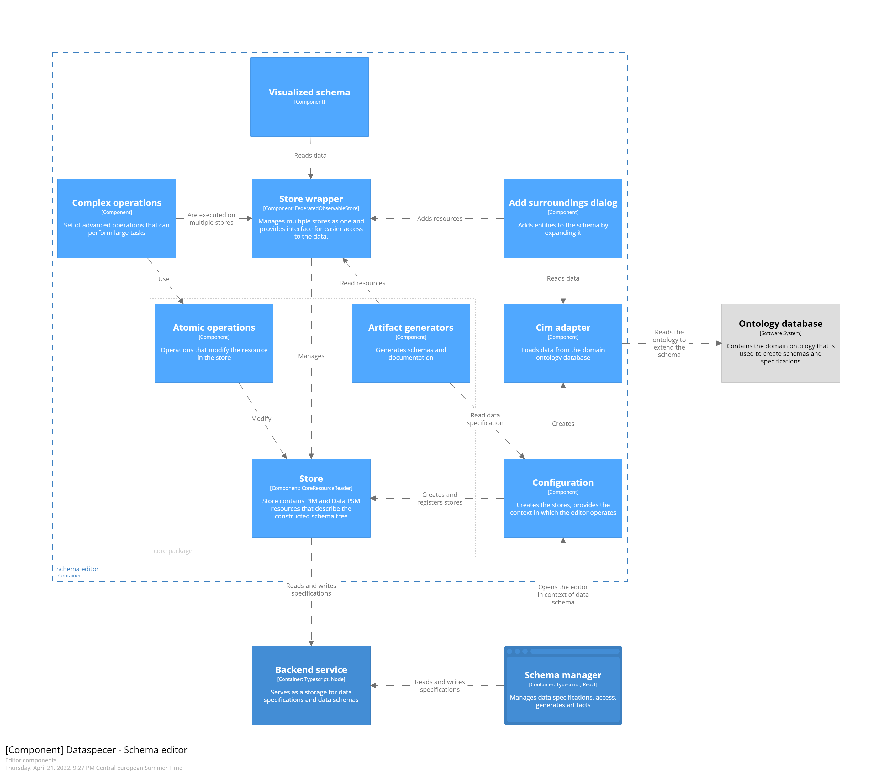

# editor application components structure

The editor is a single site web application that communicates with the **[backend](../../../services/backend) service** to load and store data schemas. The editor must be opened with URL parameters specifying its context. Otherwise, the [dummy specification](../src/configuration/providers/local-configuration.ts) is created only for testing and development purposes.

**[Configuration](../src/configuration)**, based on the context the app is opened, creates **stores**, usually `HttpSynchronizedStore`, which are `CoreModelReader & CoreModerWriter`. Because the model is typically stored across multiple stores, `FederatedObservableStore` from [`@dataspecer/federated-observable-store`](../../../packages/federated-observable-store) package is used to manage all stores uniformly. This is denoted as the **Store wrapper** in the diagram.

To easily work with the Store wrapper in React, [`@dataspecer/federated-observable-store-react`](../../../packages/federated-observable-store-react) package is used. It provides React hooks that automatically re-render HTML if the resource changes.

The editor has a set of pre-defined **[complex operations](../src/operations)** that are executed on `FederatedObservableStore`, which propagates changes into the individual core stores, and after every operation, stores are synced with the backend. The synchronization is registered in the configuration part of the application. Complex operations consist of **atomic operations** that are defined in the core package.

Then, there are several dialogs in the application. Namely, [detail](../src/components/detail) dialogs show detail about the given resource and may edit its properties. **[Add surroundings](../src/components/add-interpreted-surroundings)** dialog prompts the user to select the surrounding of the selected class, to be added to the schema. It uses a **CIM adapter**, which is created by the configuration part of the application. Currently, there is only one adapter, but we are planning to add others. Then, the user could decide in the manager which ontology he or she would like to use, and this will be in the context the editor is opened.

